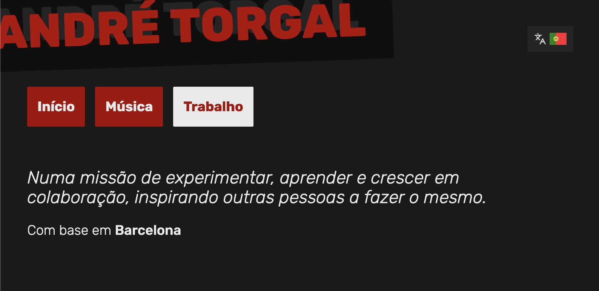

# andretorgal.com

This repository contains the content and code for my website.

> Visit the site: https://andretorgal.com/
>
> 

## Built with

This is site is built with:

- [Markdown](https://www.markdownlang.com/)
- [Unifiedjs](https://unifiedjs.com/)
- [Nunjucks](https://mozilla.github.io/nunjucks/)
- [i18next](https://www.i18next.com/)
- [Vanilla.js](http://vanilla-js.com/)
- [Chroma.js](https://gka.github.io/chroma.js/)
- [PostCSS](https://postcss.org/)

I used [PenPot](https://penpot.app/) to sketch the initial ideas and as the source of truth for the design tokens.

An AI model was used to correct mistakes and assist with research but the concepts and coding are essentially human.

## Typography and Icons

- [Rubik](https://fonts.google.com/specimen/Rubik?script=Arab&preview.script=Arab&query=rubik), hosted by [Bunny.net](https://fonts.bunny.net/)
- [Lucide icons](https://lucide.dev/icons/)
- [Yammadev's flags](https://github.com/yammadev/flag-icons/)

## MIT License

Copyright (c) 2026 André Torgal

https://andrezero.mit-license.org/2019-2026
