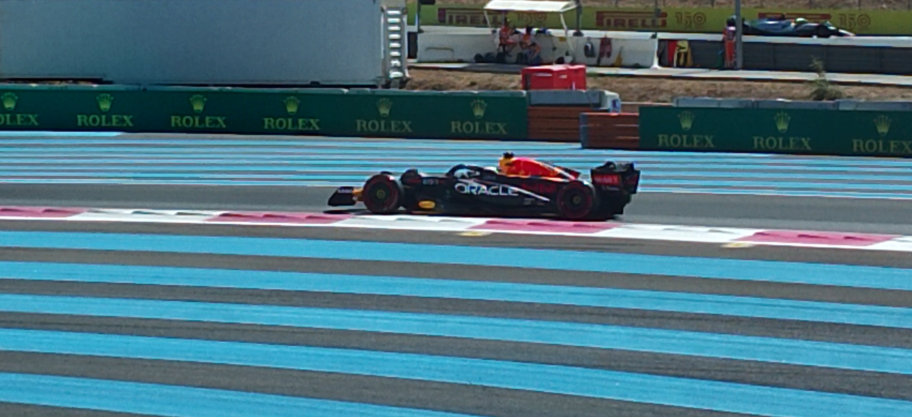

<Abstract>

They said it couldn't be done, but we drove to France to take a look. In the end, F1 is not that great experience to see live. Unless you are interested in the beautiful decay of civilisation :smirk: because all of this is obviously not sustainable.

</Abstract>

We were driving from Barcelona just to watch qualifying Saturday (there were no more tickets for race day!) and I was terrified when I heard there are usually traffic jams and huge queues around the circuit.

Plan was to wake up at 6AM. Would we make it in time? [Reddit had the answer](https://www.reddit.com/r/formuladank/comments/w23gvv/comment/igp6yx9/?context=3).

> Doomed plan… when I went in 2018 it’s was 3 hours queue to leave the circuit back down the 1 way road. I would say watch it in a bar.

## Checks out: it is insane

Obviously if you are flying this circus around the world, inviting 400 thousand car enthusiasts to a remote, agricultural place, with people driving hundreds, sometimes thousands of miles, to park in in

Oh yeah, you can ride the helicopter instead, if you fancy.

Obviously, there will be queues. And carbon monoxide. And sweat and disposable plastic bottles. And disposable "fresh humid air in a can" :exploding_head:. And all the other emissions and :evergreen_tree: unfriendly side effects.

## And not that thrilling

True we didn't watch a race. But I know how races go from :tv: TV. The supposedly added benefit of sitting in a stand, and watch up close those 3 corners? :thumbsdown:

They roar, they're fast, and then they're gone. It's really monotonous.

And you get no commentators, no hype, no realtime data, no angles, no replays, no audio, ... and no comfort from your couch or even a close by toilet.
