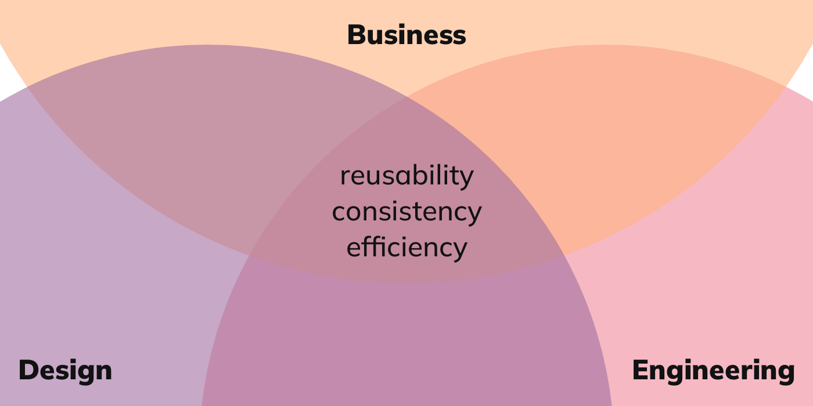

<Abstract>

In this brilliant talk, Lauren LoPrete (Senior Product Design Manager at [Dropbox](https://www.dropbox.com/)) shares experience and provides useful tips on how to increase the system’s sphere of influence and buy-in from stakeholders.

Bonus: :moneybag: a priceless insight on why rolling out a design system can be challenging.

</Abstract>

<Hero>

</Hero>

Design systems are some times seen as "a nice to have" and/or perceived as complex and costly to rollout, and it can be hard to compete with other priorities and make sure that investment is on the agenda.

In this talk, Lauren LoPrete shares mistakes and lessons learned, and offers advice, a lot of advice, to help us navigate the challenges of design systems buy-in and advocacy.

And if this wasn't valuable enough :100:, Lauren organises everything neatly with the help of some powerful :muscle: mental models.

## Drivers of culture change

I captured and paraphrased a bunch of bullet points as a guide to my own journey, and I am reproducing them below.

However, for me, the main takeaway was this beautiful insight:

> Design systems are culture change designed as a UI Kit.

Indeed, :exploding_head: building a design system requires that different parts of the organisation acquire new mental models and develop new behaviours, in order to pursue a certain set of agendas.

Not directly taken from the talk, but from personal experience with culture gaps in different types of organisations, adoption of a design system requires:

- Engineering and design collaborating more synchronously, with less handoffs and more hands on (pun intended).
- Both design and engineering growing a strong desire for operational efficiency, learning how to systematically reduce waste.
- A business culture informed by [management, design, and engineering best practices (\*)](#best-practices) making sure that the right agendas are reflected in the organisation strategy.

## And now for the advice

For design system leads, managers, advocates:

> Getting your org to commit to this change often requires influencing across all levels from designers to VPs. In doing so, you’ll rely on skills like communication and relationship building, in order to expand your system of allies.

[Full slides also available](https://www.dropbox.com/s/vjbx8nmk5xsfu4y/Lauren-LoPrete-Schema-expanding-spheres-of-influence.pdf?dl=0).

<iframe
  width="100%"
  height="400"
  src="https://www.youtube.com/embed/On3w6zPQPHU"
  frameBorder="0"
  allow="encrypted-media; picture-in-picture"
  allowfullscreen
></iframe>

## Main insights

Driving change requires new tools to expand influence:

- trust
- relationship
- partnership

> Influence does not rely on having authority, relies on trust and clarity.

### Dos and don'ts

- focus on the real decision makers
- but don't forget who is leadership listening to :wink:
- acquire advocates by learning what motivates them
- build trust by helping people improve their craft
- expand ally network by creating shared understanding
- focus on quick wins to learn the muscle
- focus on the good
- [beware of burnout](https://www.youtube.com/watch?v=d22qO_RvaQc)

### Establish trust with designers

- build relationships
- understand each designer’s (diverse) background
- help designers see the bigger context where they’re building
- help designers expand their skill set
- improve designers onboarding, build trust from day 1
- offer 1:1 pairing
- attend design sessions
- implement feedback loops

### Establish trust with managers

- managers are your peers
- they have more information about product strategy
- they are usually unfamiliar with design system concepts
- establish trust by asking “what’s important for you now?”
- seek shared understanding through complimentary goals
- work with them to get early feedback on ideas
- and be open to them challenging your ideas

### Influence senior leaders

- most decisions are made by product leaders
- find leaders that have a track record of affecting change
- communicating up requires a different language
- learn to speak their language
- and practice brevity
- figure out first what motivates them
- provide context and clarity
- help them understand your goals
- establish realistic expectations
- turn them from silent supporters to vocal advocates

## Focus on the good

An important

Turn up the good, amplify what is going well and look for network and compound effects of your efforts - as opposed to focusing on knocking down the obstacles or fighting head on against instances of push back.

> Focusing on the black spots is the path to burn out.

This related, and very relatable, other [talk by Lauren LoPrete talk about design systems burnout](https://www.youtube.com/watch?v=d22qO_RvaQc) dives deep into this delicate matter.

<Note type="blog">

## :writing_hand: Related posts

- [What is a design system?](/posts/2023-02/what-is-a-design-system) - combining systems and business perspective
- [Benefits of design systems](/posts/2023-02/benefits-of-design-systems)

</Note>

## Best practices

- [The systems thinker](https://thesystemsthinker.com/)
- [O Reilly: What is lean UX?](https://www.oreilly.com/radar/what-is-lean-ux/)
- [IDF: What is design thinking?](https://www.interaction-design.org/literature/topics/design-thinking)
- [Nielsen: UX Maturity Model](https://www.nngroup.com/articles/ux-maturity-model/)
- [Kanbanize: lean management](https://kanbanize.com/lean-management/getting-started-with-lean)
- [Extreme Programming: A gentle introduction ](http://www.extremeprogramming.org/)
