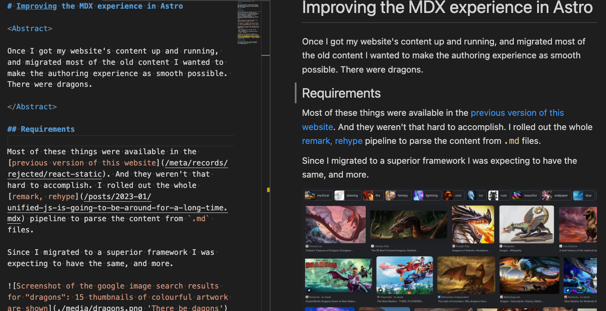
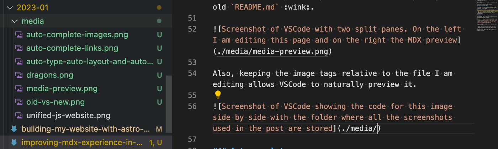
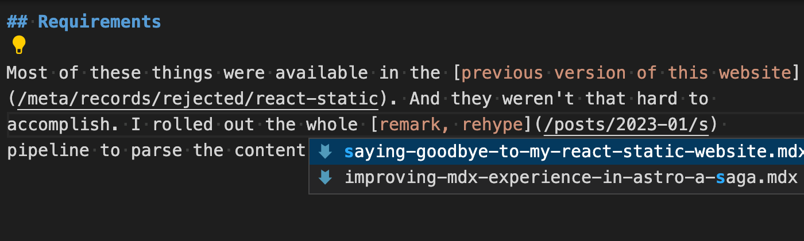

<Abstract>

Once I got my new website's [information architecture](/meta/docs/information-architecture) up and running, and migrated most of the old content, I want to make the authoring experience as awesome as possible. :star-struck: At least as good as it was on my previous sites.

</Abstract>

## Backstory

I don't publish that much on the web these days. Not compared to the old times. But I have a long story, and a quite personal relationship, with content management.

Between early 2000s and 2008 I had [a "tireless", and experimental presence on the web](/meta/project/archaeology#around-2000), sometimes running on my own code, sometimes running on things like Wordpress. Sometimes a combination of both.

During my career so far, I also created from scratch several bespoke CMSs. And in the past few years, I am using [MDX](/tags/mdx) daily, building documentation for component libraries and design systems.

So, when it comes to [migrating my site to a new framework](/posts/2023-01/building-my-website-with-astro-mdx-preact),
and looking at what features are available out of the box - and which ones I will have to rollout myself - I have a huge shopping list, a big appetite to invest, and I am going all in.

## Shopping list

- Seamless preview as I type.
- Along with auto-complete for links and images.
- Sensible defaults for page metadata.
- Extract `title`, `description`, `og:image`, and more from the content.
- Decorate external links.
- Automatically import "react" components referenced in the `MDX` content.

For images alone, I will settle with nothing short of:

- Optimise images for responsive sizes.
- Using both modern and fallback formats.
- Semantic `<figure><picture><figcaption>` pattern.
- With easy way to show a caption and an attribution link.
- Generate as little as possible in `dev` mode to speed up preview experience.
- And [minimised CLS](https://web.dev/optimize-cls/) by reserving vertical space for all images.

---

Here's a more detailed look at some of these items, why they are so important to me, and how they combine to provide an awesome :star-struck: experience.

### Seamless preview

Number one item: keeping the markdown source code as _natural_ as possible.

I want to type all the links as absolute paths from the root of the site `/posts/1998-03/post.mdx`, including the `.mdx` extension and allow VSCode to navigate from link to link on the MDX preview just as it does with your good old `README.md` :wink:.



Also, keeping the image tags relative to the file that I am editing allows VSCode to just preview them as I type. And yes! :point_down: I want the images right next to this file.



### Auto complete

The above strategy for links and images also provides the **indispensable** auto complete. When I am typing links or image paths in MDX files, I just want it to drop down and help me out!


The same goes for links.

Most pages of this website exist in the filesystem, so it would be a shame to mess with VSCode's ability to auto-complete as I type.



### Image optimisations

I want my [SSG](/tags/ssg) to
detect all images and extract, beyond the `alt` and `title`, also an attribution text and a link.

```md

```


I also want it to render responsive images, with different resolutions for different screen sizes. And generate modern `avif` files as well as a legacy fallback formats. If you're curious, I wrote about [why avif instead of webp](/meta/docs/responsive-images#image-formats).

```html
<picture>
  <source
    type="image/avif"
    srcset="image-700px.avif 700w, image-1400px.avif 1400w"
    sizes="(max-width: 650px) 86vw, (max-width: 1200px) 650px, 1400px"
  />
  
</picture>
```

Finally, I want `dev` mode to use as little resources as possible to speed up the dev experience. It should only generate images for the page I am previewing, generating on demand whatever is requested by the browser, and should use something like `50%` quality `jpg` only.

On the other hand, in static build time, it should optimise for production, using settings for better quality, and generate all the formats for all the files.

### Auto detection of metadata

This is a no-brainer. I don't want to type things in frontmatter if they can be authored in - and then extracted from - the document.

```md
---
title: Improving the (MDX) authoring experience in Astro
description: 'Once I got .... dragons'
ogImage: ./media/dragons.jpg
published: 2023 Jan 26
---
```

I want to have the full markdown experience. I want my "abstract" to have links, italics, and emojis :beer: damn it! And I want to render it wherever I want in this page, on another page that lists posts. And I want it to be markdown everywhere. Again: links, italics, emojis.

But at the same time I also want to render `<meta name="description">` and `og:description` tags. Of course, in this case, I want to strip out all the funny stuff from the original content.

```mdx
<Abstract>

Once I got my new website's [information architecture](/meta/docs/information-architecture) up and
running, and migrated most of the old content, I wanted to make the authoring experience as
awesome as possible. :star-struck: But I should know ... There might be dragons :dragon: :dragon:
:dragon:

</Abstract>
```

Finally, `og:image` should default to the first image, unless specified otherwise in the metadata. And the `<h1>H1 Title</h1>`, also rendered as `og:title` and `<title>title</title>` should, by this logic, be the

```md
# Title
```

There are 2 principles at work here:

- DRY: don't repeat yourself!
- The document is the source of truth, the metadata just just be a crutch.


### Frontmatter defaults per type of content

It's a pain to have to type in all my blog posts that they are `type: post` or that they use `layout: ../../../templates/BlogPost.astro`. :nauseated_face: Lame, time waster, error prone.

I want all blog posts to be `type:post` and tags to be `type:tag` (maybe more in the future :wink:) and I want the generator to provide defaults for the repetitive stuff.

### External links

Show an [arrow](https://en.wikipedia.org/wiki/Arrow) :point_left: decoration on external links must to help users know if they're leaving my site... Oh no! don't leave! Come back!

Also, all external links must carry the `rel="noopener"` attribute [for security and performance reasons](https://linkilo.co/rel-noopener/).

### Auto-imports

I also don't want to have to import components that I use often in my pages. I want to be focused on the content and have `<Hero>`, `<Abstract>`, `<Video>`, that type of stuff, always in scope.

## Why stop here?

The moment I have all of these features working, I will want more for sure!!! I will want VSCode to preview my :beer: and auto complete my emojis as well... :pleading_face: pretty please?

I might have to dig into VSCode extensions as well.


There's also plenty of content related challenges in [my website's backlog](/meta/project/backlog) such as a link roll worthy of the 20s. We're in the future, I want to embrace it. :rocket:

## Meanwhile

I still have to make all of the above happen first. Out of the box, Astro provides none of it.

This narrative continues with [a look at Astro's built-in features and their opinionated patterns and limitations](/posts/2023-01/mdx-authoring-experience-in-astro-shortcomings-and-astro-m2dx), along with an evaluation of the existing community driven projects.

Will I be able to build it?

:drum_with_drumsticks: :drum_with_drumsticks: :drum_with_drumsticks:
