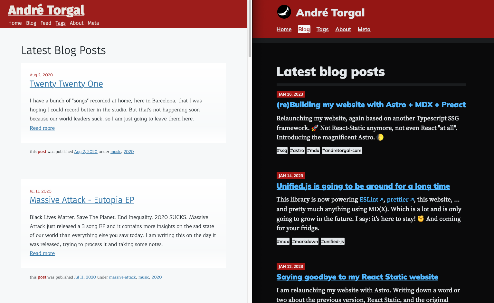

<Abstract>

Astro built-ins and plugins are not sufficient to deliver all the features or details that I want to have. But that's no problem at all because Astro is very open for extension!

This post is the summary of my hands-on, head first, and all heart approach at piecing together the [Astro integration](https://docs.astro.build/en/reference/integrations-reference/) that delivers my ideal :star: MDX authoring experience.

</Abstract>

<Note type="old">

## :warning: You are looking at an outdated post.

I meanwhile upgraded Astro from 1.9 to 5. Some of the code below no longer looks the same. Relative images are now supported out of the box in Astro :partying_face:. Happy days!

</Note>

By the end of 2022 I helped a friend build a simple website with [Astro](https://astro.build) and I basically saw the light: :bulb: Astro is simple, elegant, and smart. It performs, and scales. Opinionated but extensible. A growing community vibing behind it. All of this and funding. :moneybag:

> I am quite surprised that you are so interested in something that I suggested

Yeah man, thank you for the tip!

I was so excited about it that I decided to [(re)build my website with Astro](/posts/2023-01/building-my-website-with-astro-mdx-preact). And so confident, that I aimed at a pretty big list of [requirements for an awesome authoring experience](/posts/2023-01/advanced-mdx-authoring-experience-requirements).

## Kudos :100: \* :100:

:raised_hands: [The Astro community](https://astro.build/blog/community-awards-22/), the [Astro Technology Company](https://astro.build/blog/the-astro-technology-company/), the core team, the documentation team, all the teams, yeah! :raised_hands:

:raised_hands: The remarkable [astro-m2dx](https://astro-m2dx.netlify.app/) project which shares the same ideas of what great markdown experience looks like. :raised_hands:

:raised_hands: Hundreds of remark and rehype plugins that I browsed and :exploding_head: had me exploding with ideas! The [unified ecosystem is prospering](/posts/2023-01/unified-js-is-going-to-be-around-for-a-long-time)!

## :hammer: Let's build it

<Note type="warning">

:warning: This is not meant to be a tutorial. I do not recommend that you add so many dependencies and custom code to your site. Unless you are an obsessive tinkerer, willing to pick up a fight with a mob of though tasks, you will regret it.

</Note>

## Using relative paths in images

For starters, I basically replicated what [@astro/image](https://docs.astro.build/en/guides/integrations-guide/image/) does, but without the [restrictive convention of using the public/ folder for images](/posts/2023-01/mdx-authoring-experience-in-astro-shortcomings-and-astro-m2dx).

Yes! :see_no_evil: I am also opinionated about this! I like to keep my images next to my content. I want to use relative paths for my images, to have VSCode auto-complete them, and to preview them immediately.


So, the very first step was to write a remark plugin that [rewrites relative image paths to absolute](https://github.com/andrezero/andretorgal-site/blob/main/src/integration/remark/relativeImages.ts).

```ts
const publicPath = getPublicPath(baseDir, mdxFilename, node.url = publicPath;
```

Now that we're here, let's also collect an array of images used in the page, and a bit more context...

```ts
images.push(publicPath);
const { frontmatter } = file.data.astro;
frontmatter.images = images;
frontmatter.imageBaseDir = baseDir;
frontmatter.mdxFilename = mdxFilename;
```

... and we can use this to [pick the first image for use in og:image](https://github.com/andrezero/andretorgal-site/blob/main/src/components/document/Head.astro#L30) meta tags.

I will also want to use it to pick thumbnails for lists of articles, but that will have to come later. :wink:

## Component mapping

In order to have the markdown images - `` - render more than just an `` tag, we have to modify the MDX code before it is compiled, so that the correct component is in scope.

For this, I abducted the great ideas of [astro-m2dx](https://astro-m2dx.netlify.app/) and some source code: the [customComponents() remark plugin](https://github.com/andrezero/andretorgal-site/blob/main/src/integration/remark/customComponents.ts) injects the necessary `import` and `export` statements into the code.

Note that this requires installing and consuming code from a few dependencies:

- [estree](https://github.com/estree/estree), [mdast](https://github.com/syntax-tree/mdast), and [estree-util-visit](https://github.com/syntax-tree/estree-util-visit), all from the Unified ecosystem.
- [m2dx-utils](https://github.com/christian-hackyourshack/npm/tree/main/packages/m2dx-utils) - dependency of `astro-m2dx`, provides a ton of useful utils.

The component mapping file itself is as simple as import plus export:

```ts
import Figure from '@components/mdx/Figure.astro';

export const components = {
  img: Figure,
};
```

In my case I just want to render the [Figure component](https://github.com/andrezero/andretorgal-site/blob/main/src/components/mdx/Figure.astro) explained below. But this can be used to replace `ul`, `li`, `p`, `h1..6`, `hr`, any markup you wish.

If you do that you can achieve total encapsulation of components and isolation of styles. But I calling this a wrap for now. Literally - dad joke :smile: - I am wrapping all places where markdown is rendered with a [Markup component](https://github.com/andrezero/andretorgal-site/blob/main/src/components/page/Markup.astro) that _forces_ some styles down the tree.

## Image caption with attributions

Just a simple trick done in the `<Figure>` component, before it delegates rendering to the `<Image>` component, which allows me to provide an attribution inside the image title separated by `//`.

```md

```

And the attribution part of the title can also have a link that will turn into a _Visit site_ external link.


## Responsive images

Finally, the `<Image>` component is responsible for figuring out the [props for the source and image tags](https://github.com/andrezero/andretorgal-site/blob/main/src/components/mdx/Image.astro).

This includes setting the [loading](https://developer.mozilla.org/en-US/docs/Web/Performance/Lazy_loading) and [decoding](https://developer.mozilla.org/en-US/docs/Web/API/HTMLImageElement/decoding) attributes, but more importantly generating all the URLs for different file formats and resolutions to use in `` and `<source>` tags.

**In `dev` mode** it renders images via an endpoint attached to the [vite](https://vitejs.dev/) dev server. Smart: only the images requested by the browser get generated.

```
/_image?src=/posts/2023-01/_media/waterfall-in-forest.jpg&amp;width=700&amp;format=avif
```

**And during the static build** it generates public paths like `/posts/2023-01/_media/waterfall-in-forest-700.avif` and collects them - via a [rather questionable globalThis hack](https://github.com/andrezero/andretorgal-site/blob/main/src/integration/index.mjs#L70) (please Astro community provide some better pattern? :pleading_face:).

After all the HTML is generated, it takes the collected `staticImages[]` and generates all the individual formats.

By the way, I am using different responsive breakpoints and sizes for different types of images.

- Regular images: 700px | 1400px
- Hero images: 700px | 1400px | 2800px
- Open graph images: 1200

I defined all the [image profiles in one place](https://github.com/andrezero/andretorgal-site/blob/main/src/integration/images/profiles.ts) and then merge the profile into the images props as late as possible.

## Markdown wraps images in paragraphs, let's fix that

Since we are rendering `<figure>` instead of directly ``, the wrapping paragraphs result in invalid HTML - `<p><figure>...</p>` and that can cause extra empty paragraphs polluting the rendered documented.

```html
<p></p>
<figure>...</figure>
<p></p>
```

Adding `remark-unwrap-images` to the [integration list of remark plugins](https://github.com/andrezero/andretorgal-site/blob/main/src/integration/index.mjs), just before the `relativeImages` plugin, did what the name says.

## Auto imports

For the "auto imports" features I also based it off [astro-m2dx](https://astro-m2dx.netlify.app/) code and I am importing a bunch more from the `m2dx-utils` package and, as usual, a few more tools from the [Unified.js](/posts/2023-01/unified-js-is-going-to-be-around-for-a-long-time) ecosystem.

With the [autoImports() remark plugin](https://github.com/andrezero/andretorgal-site/blob/main/src/integration/remark/autoImports.ts#L45) we can inject the necessary import statement into the MDX context whenever it detects the components are being used in the document.

We can then define which components to make available using a simple [auto imports file](https://github.com/andrezero/andretorgal-site/blob/main/src/integration/remark/autoImports.ts) such as this one:

```tsx
import Abstract from '@components/Abstract';
...

export const autoimports = {
    Abstract,
    Audio,
    Code,
    ...
};
```

Again, `astro-m2dx` lets you create "auto import files" wherever you want in your project and does all the work to scan the file system for them every time it builds a page.

I decided to go with _single auto-imports file_ because [YAGNI](https://martinfowler.com/bliki/Yagni.html), cutting complexity, and improving performance.

## Eliminating layout shift.

Layout shift happens when the browser loads a resource and realises it needs to push content down and/or the side to make space for it.

If we know the width/height of the image we can prevent this by using the [padding-top + percentage technique](https://css-tricks.com/aspect-ratio-boxes/) to reserve the space.

To find out the aspect ratio and make it available where it's needed, I wrote a couple of functions to [readImage()](https://github.com/andrezero/andretorgal-site/blob/main/src/integration/images/utils/readImage.ts) into an instance of [sharp](https://github.com/lovell/sharp) and to [getImageFacts()](https://github.com/andrezero/andretorgal-site/blob/main/src/integration/images/utils/getImageFacts.ts). I took the opportunity to also find the dominant colour :lower_left_crayon: which I use as the background colour, visible while the image is loaded.

## Extracting an article abstract from the content

Another simple [remark plugin, autoAbstract()](https://github.com/andrezero/andretorgal-site/blob/main/src/integration/remark/autoAbstract.ts), detects the `<Abstract>` component in the page and allows me to render its content, as markdown, anywhere on the layout, or even in other pages, [lists of posts](/posts), etc...

```tsx
<Abstract>Describe! [Link](/) :cowboy: Emoji!</Abstract>
```

I can also use the extracted content to render `<meta name="description">` and `og:description` tags, stripping out all the funny stuff :alien: of course.

## Extracting hero images from the content

A very similar process, another [remark plugin, autoHero()](https://github.com/andrezero/andretorgal-site/blob/main/src/integration/remark/autoHero.ts) identifies an image wrapped in `<Hero>`.

```tsx
<Hero>
  
</Hero>
```

This way we can author the hero image in the normal flow of content, but then render it in different places such as the [BlogPost layout](https://github.com/andrezero/andretorgal-site/blob/main/src/templates/BlogPost.astro#L36). I later intend to use it in lists of posts.

## External links decorated

Not necessarily an authoring improvement, but the quick [externalLinks() rehype plugin](https://github.com/andrezero/andretorgal-site/blob/main/src/integration/rehype/externalLinks.ts) adds a little CSS to display an [arrow](https://en.wikipedia.org/wiki/Arrow) :point_left: decoration to help users know if they're leaving my site... Oh no! don't leave! Come back!

Also, all external links must carry the `rel="noopener"` attribute [for security and performance reasons](https://linkilo.co/rel-noopener/).

## What's next?

Next weekend I plan to figure out the whole [stay in S3 or move to Netlify](/meta/records/pending/hosting-netlify-or-s3) conundrum.

Priority is to replace the old version with the new one.



Then I'll follow up with my [website's backlog](/meta/project/backlog):

- Remove the `.mdx` extensions from the links with a `remark` plugin.
- Setup the frontmatter defaults per type of content.
- The Only _title_ should be the document's `# title` itself.

And many other content related features, such as media galleries, links, reading time, and - god forbid! - comments! :innocent:

```

```
