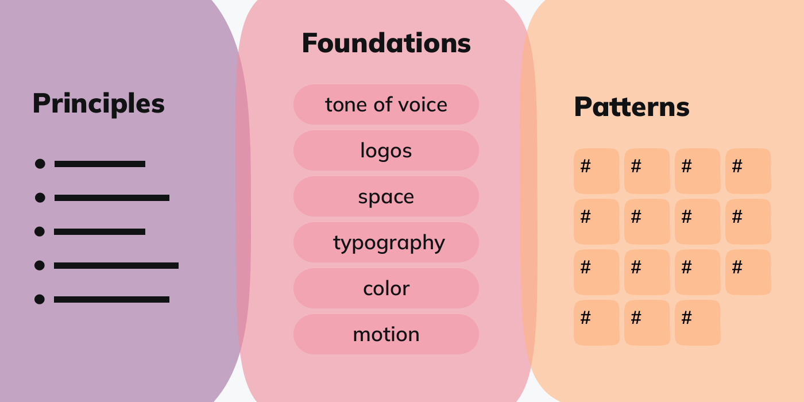

<Abstract>

In an attempt to break up the conversation around design systems in more concise posts, here's the one where I am listing benefits and direct and indirect impacts of design systems in organisations.

</Abstract>

<Hero>

</Hero>

Even if you have a good understanding and first hand-experience with design systems, I invite you to read my take on [what is a design system?](/posts/2023-03/what-is-a-design-system) first, as it emphasises the _it's a system_ angle that I apply in some of these thoughts.

## Better user experience

Mature design systems promote consolidation of design principles with strong alignment with the organisation's mission, strategy, values, and brand, and promote implementation with minimum effort and maximum impact.

Solid, aligned, and well understood principles are essential to inform and coordinate the effort of consolidating design language and interaction patterns into smaller, more concise and cohesive, ultimately more flexible and reusable, collections of patterns.

Investing in consistency (along with simplicity) while [not necessarily the holy grails of design](https://jmspool.medium.com/consistency-in-design-is-the-wrong-approach-3cfbc87a327), contributes to building more economic and maintainable architectures, more straightforward products, easier to learn by both builders and customers alike.

## Engagement, conversion, loyalty

Consistent experience unlocks "an aesthetic usability effect", with very real feelings of affection, loyalty, and patience. In her talk at Schema 2022, Patrycja Rozmus explains better the [positives effects of consistent, high quality, user experience](/posts/2022-11/multidimensional-omni-channel-design-systems), and quotes some interesting studies.

> For organizations with brand consistency issues, the estimated average revenue increase attributed to always presenting the brand consistently is up to 33%
>
> [State of brand consistency report](https://info.marq.com/resources/report/brand-consistency) (paywal :key:)

I find it hard to believe that it's easy to objectively measure the effect of consistency in isolation from other factors. So I am very skeptical towards most fleeting claims I read online, even if I believe in the theory.

Maybe in the future we can have more studies, more data, more supporting evidence. :pleading_face: For now, theory, beliefs, and paywalls are pretty much all we have.

Also, maybe consistency is in the eye of the beholder and can vary from culture to culture or even market to market?

For some, 80% consistent will feel like pretty good, just rough around the edges. However, in other more demanding markets, 99% consistent makes the remaining 1% stick out like a sore thumb.

Think about [suspension of disbelief](https://en.wikipedia.org/wiki/Suspension_of_disbelief) as in movie terms: how many glitches and goofs does the producer have to eliminate to get people to forget that what they're watching is actors in a movie, not real people in real life? Probably all of them.

## Lean operational efficiency, at scale

Design systems also impact business performance by promoting efficiencies up and down the value stream. In lean speak, design systems help reducing several [types of production waste](https://hackernoon.com/7-wastes-in-lean-software-development-and-how-to-prevent-them-7bi3tqp).

Transportation and motion - think communication overhead, handoffs, and context switching - are greatly reduced by reusing decisions and building blocks. Literally less layers to design, plan, and implement, allow teams to stay focused on the user tasks, business outcomes, and the _solution space_.

At the same time, literally moving and assembling less parts during delivery, reducing variance of work items, and investing in higher quality, well documented primitives, produces less defects and less rework. It's a no-brainer.

Investment alone does not guarantee returns - standardisation and systematic waste reduction require disciplined application of best practices, and a culture of transparency, collaboration, and perseverance.

> To quickly build digital products with effective UX designs, software engineering leaders must leverage design systems that promote reuse and assembly.
>
> [Gartner, Software Engineers Need Design Systems to Build Products With Good UX](https://www.gartner.com/smarterwithgartner/software-engineers-need-design-systems-to-build-products-with-good-ux)

I also believe that in a systematised world, it's easier to keep tabs on over-processing because the teams are now free from making low level decisions all the time, and they focus on the essential.

In the below section on collaboration, focus, innovation, there's also a hint at ways of reducing underutilised skills and talent, probably the most toxic waste - in many senses - in organisations dealing with knowledge work. :see_no_evil:

These arguments should speak very loudly to anyone seeking business. :mega: Beat your competitors! :mega: Be the first to market! :mega: All while wasting less resources!

Strong arguments, hum?

## Collaboration, focus, innovation

Design systems enable better collaboration between brand, marketing, and product designers by providing clarity, expertise, and support around foundational aspects of an organisation's design, such as color, space, typography, and accessibility.

Moreover, designing and building less variants, together with cutting down on redundant daily operations, releases time to focus on the kick-ass stuff. :star-struck:

And not just fancy, sophisticated stuff, there is actually a strong [business case for digital accessibility ](https://www.w3.org/WAI/business-case/), sustaining that it results in extended market reach. :sweat_smile: Yes, I am biased towards my own definition of kicking ass, i.e., being better than everyone else at being usable, accessible, human, all inclusive.

Finally, less tedious work and more time to focus on interesting things, along with fostering convergence around a common set of principles and practices, creates an environment where creative energy, teamwork, and collaboration can strive.

And do you know [what happens when designers and engineers connect](https://vimeo.com/262519127)? Magic! :wink:

## Turning decisions into capital :gear:

The essence of a design system is the process of refining, consolidating, and socialising design decisions, to maximise reuse and promote evolution.

Once systematised, design decisions materialise into tangible assets. And not just libraries and tools :gear::gear::gear:, also into intangible qualities of the system: creativity, experience, talent, knowledge, culture. :artist: :teacher: :technologist: :scientist: :astronaut:

The scope and level of detail that each organisation is able to systematise depends on a lot of factors, but the focus tends to be on:

- core, foundational decisions, with implications across several areas of the organisation;
- building blocks with high reusability potential, even if specific to a single channel or platform.

In a brilliant talk at Figma Schema 2022, Patrycja Rozmus lays out in very visual terms the potential to systematise decisions [across all organisation channels](/posts/2022-11/multidimensional-omni-channel-design-systems), and in yet another brilliant talk, Lauren LoPrete shares powerful insights about [the more intangible assets](/posts/2022-11/design-systems-are-design-culture),
namely knowledge and culture.

## Shift gears, push constraints :rocket:

You are probably familiar with the [Project management triangle](https://en.wikipedia.org/wiki/Project_management_triangle) of constraints: it's not possible to achieve more scope in less time, without sacrificing cost, quality or both. Conversely, it's not possible to raise quality or lower costs, without a reduction in scope or an extension in time.

While this is a useful mental model to analyse tradeoffs at the beginning of a project (short term, fixed mind set), we shouldn't apply the same logic to investment and return cycles (long term, growth mindset).

A successful investment/return cycle actually shifts the shape of a system's constraints. It's called capitalism, that thing where the right investments affect the quality, efficiency, and time functions of the system.

_Note: as opposed to approaches that attempts to achieve more scope in less time and same quality, without the accumulation of capital, typically via extracting more value from the same individuals._

In the end, investing in design systems is similar to investing in devops, evolutionary architectures, clean code, and other best practices. But, because of where they sit on the internal value chain, I believe design systems have much more direct impact over cycle and lead times, via reducing the number of decisions to make and details to (re)implement on each project.

## Unlock new capabilities

With a mature enough design system in place it's easier to commit to site-wide projects such as changes to visual language or even full rebranding.

Obviously, it's possible to achieve these things without a design system. But these projects have high costs, high risks, and usually require focused execution across different parts of the organisation.

A design system is the backbone for these operations. Not only it helps with achieving better results, it once again reduces operational costs and risks, by minimising the number of moving parts and actors that need to be involved.

Not only the design system takes takes care of the core implementation details, it also provides a common framework and language to collaborate, and frees up focus for coordination and synchronisation.

<Todo>Post: Design Tokens</Todo>

<Todo>figure tokens, themes, brands</Todo>

When different platforms and channels - think web, mobile, email, social media - can share common asset libraries, documentation, and workflows, they can much easier synchronise dependencies in mission critical initiatives.

Also, treating the fundamental design decisions as data - spacing, typography, colour, ... - enables radical new approaches to development at scale and features such as "dark mode" or "white branding" become feasible because the capabilities are provided centrally and reused everywhere.

## Recommended reading

- [Investopedia: Brand equity](https://www.investopedia.com/terms/b/brandequity.asp)
- [UX Planet: Good design is consistent design](https://uxplanet.org/good-design-is-consistent-design-e8a7d2a14a34)
- [W3C: The business case for digital accessibility](https://www.w3.org/WAI/business-case/)
