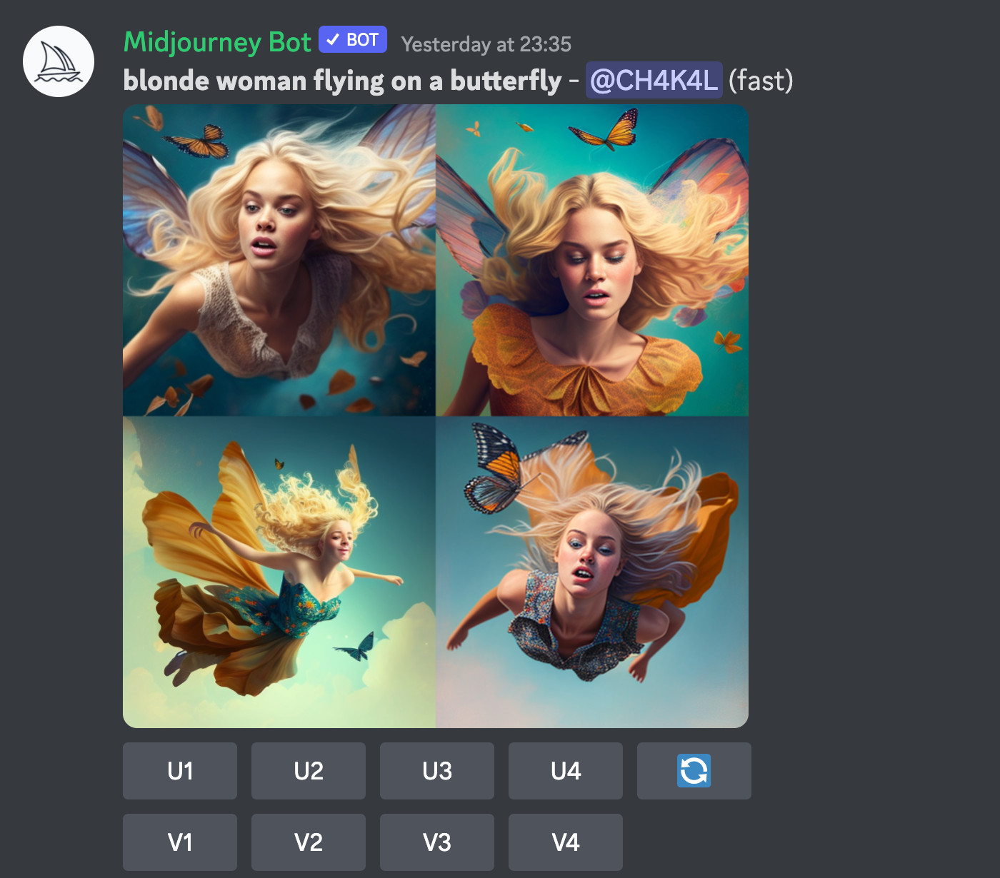
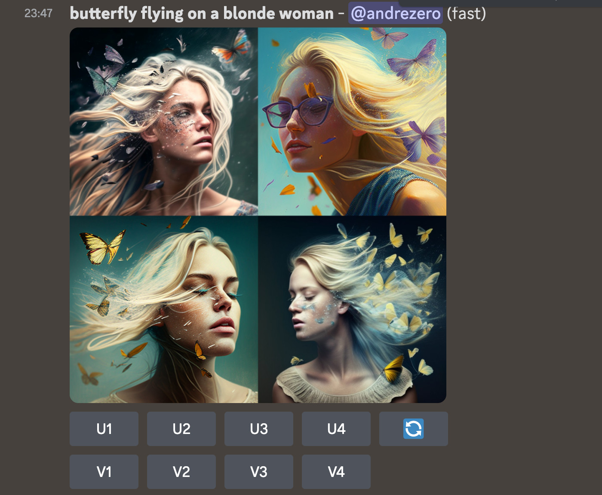
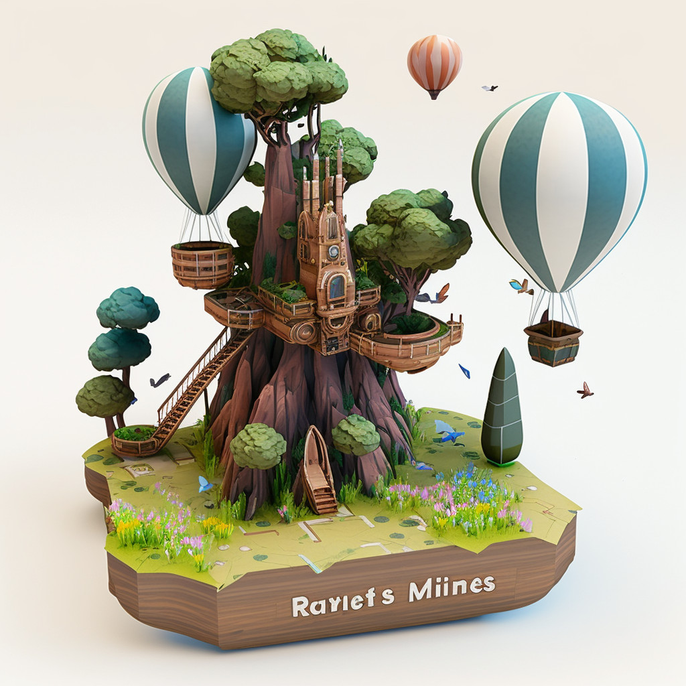

<Abstract>

Signed up for [Midjourney](https://midjourney.com) and blew up the free credits in an hour. What is even happening? This is crazy! :dizzy_face:

</Abstract>

<Hero>

</Hero>

<Note>

### :information_source: Midjourney is available in Discord only

If you want to try this out, you need to install [Discord](https://discord.com/) and get an account there first (it's free). Then you sign up for [Midjourney](https://midjourney.com/) and ask to "join the Beta". After that, if you've used WhatsApp, Messenger or ICQ, you'll figure it out.

</Note>

## Image prompts

You can upload an image and add a text prompt. I started with a picture of _moi meme_ and just asked to _make me cyberpunk, please?_ :pleading_face:

Literally, in one minute, it came back with 4 options.

This is the weirdest exercise. Some of these resemble me more than others. I wonder :thinking_face: If I kept generating options, would one come out way too close to the real thing? It's, at least, unsettling.

Here's how to freak out for real: [this person does not exist](https://thispersondoesnotexist.com/).

Refresh that page a couple of times. :point_up:

Let that sink in for a moment.

## Text prompts

On Discord you can learn from what others are doing, as you can see the text prompts they're providing for their images.

> Imagine: a blonde woman flying on a butterfly
>
> (prompt by user @CH4K4L)

But some times the machine misses the point.

It gives you 4 options, but ...

- 2 women have butterfly wings
- 1 enjoying is her magical butterfly dress
- and the last one is free falling from the sky, while an actual butterfly is standing by, watching.

I saw the above by chance, and I had to try it, of course:

> Imagine: a butterfly flying on a blonde woman

## Variations and upscales

From here, you can ask the machine to generate 4 images based on your preferred one, by pressing the **(V)ariation** buttons.

When you are happy with a variant, you can ask for a more detailed and higher resolution version, by pressing the respective **(U)pscale** button.

Interesting enough, this process looks very similar to the [five sheet design process](https://towardsdatascience.com/five-design-sheet-methodology-approach-to-data-visualisation-603d760f2418) used in data visualisation design:

- brainstorm
- explore variations
- upscale

## High entropy prompts

Inspired by the very long prompts people are typing on the discord channels, I gave it a go with a bunch of fantasy non-sense.

I described a confusing setting, with loads of items, and 3 characters, curious of how Midjourney would deal with a high entropy prompt.

> 3d platform gaming console game, designed in the style of Studio Ghibli. The scenario has a bumpy floor [...] tall green tress [...] mountains in the distance, and pointy castles [...] In the foreground the main characters are a happy bouncing dirty sports sock with googly eyes [...] semi-transparent blue umbrella [...] cabbage with a dragon face ...

It decided to ignore the characters altogether. No mister sock, no umbrella, no dragon cabbage. Also: tree, castle, even some balloons, all merged into one central piece. All mounted on a base, and an x-box remote thrown in for good measure. :face_with_spiral_eyes:

Quite cute, but no dragon cabbage.

## Specifics are hard to achieve

The results are always surprising, even impressive. But you have to learn how to feed the machine with effective descriptions and know what the medium is capable of.

> sci-fi navigation console of a spaceship, futuristic holographic displays, [...] superimposed orange light holographic user interface with gauges, levels, labels, charts

I thought holograms are _projected in the air_, not bolted against the wall in retro-futurist submarine style. This machine was clearly not properly trained on the good stuff. I suggest having it study exhaustively the [vast screen universe of The Expanse](https://www.pushing-pixels.org/2016/01/21/a-window-into-another-world-interview-with-timothy-peel.html).

I am disappointed again. And yet [people are subscribing to Midjourney (how many, though?)](https://tokenizedhq.com/midjourney-statistics/) and paying 9 bucks a month for 200 attempts at this.

Even if you don't care much about the result, it's still a lot of pressure for entertainment purposes. :sweat_smile:

## Will there be less demand for illustrators?

A lot of people are already using this professionally, in which case 10 or 25 bucks is a bargain. If you are an illustrator coming up with ideas, you can certainly work faster (or less).

And if you are an employer, hiring illustrators, you can now demand a lot more (or hire a lot less people).

Of course, Forbes is still able to spin the [humanist, consumer-oriented](https://www.forbes.com/sites/robsalkowitz/2022/09/16/midjourney-founder-david-holz-on-the-impact-of-ai-on-art-imagination-and-the-creative-economy/) story. Reading these pieces is always an exercise in "Where's the fallacy?".

> A: The market has already established a price that people are willing to pay.

There it is! :point_up: That's not how supply / demand equilibrium works!

## Can I use this for my own stuff?

What if I subscribe and use it to create illustrations and hero images for my blog posts? Certainly more powerful than just fishing for content in [Pexels](https://pexels.com).

> city wall with broken windows and rusty doors covered with colourful graffiti with abstract shapes and paint splatters [...] and super bold typography, in the style of Enki Bilal

Again, it ignored the style directive and focused on the literal description. My bad, I didn't read [the ultimate midjourney prompt guide](https://exploreai.substack.com/p/the-ultimate-midjourney-prompt-guide) and I didn't check if the machine was forced to read [Enki Bilal's amazing books](https://en.wikipedia.org/wiki/Enki_Bilal). It sure did become proficient at [everything in the style of Wes Anderson](https://www.polygon.com/23494958/wes-anderson-midjourney-ai-art-generator-viral-trend), though.

Regardless, all of these look pretty cool.

And upscaling the upscale adds even more details, more textures, more sophisticated light. In this case, the enhanced paint drip, dirt, smudges, cracks, and rust, were all becoming realistic.

I want to click again and see what happens next. I am intrigued by the face in the door, the poster on the left. But I also want to go back on previous iterations and see where it leads.

Ran out of credits, though. :moneybag: I am out of here.

<Todo>

on consistency: [track your seeds to achieve consistency and continuity](https://www.forbes.com/sites/tjmccue/2023/01/30/make-sure-your-midjourney-ai-image-prompts-have-this-parameter/) required for large scale projects.

... people have been building ...

</Todo>

## More, more, better, faster, now

Midjourney gives you 25 credits to experiment with and I burned them all with a few experiments in less than an hour.

People are paying 10 or 25 bucks a month to sit in front of this software and generate stuff. Some people burn their credits by creating endless variations of the same thing or upscaling for more detail, more detail, more detail ...

The activity is insane. Take a look at the [Midjourney showcase](https://www.midjourney.com/showcase/recent/) and have your mind blown out. What's going on?

Is this a new form of addiction already? I bet the endorphin discharges are something to look back to, if you get hooked on this shit. :scream: Yet another form of _we're doomed_.

## Cabbages

I realised later my cabbage prompt must have been inspired by the [incredible marriage of John Oliver and cabbages](https://www.vulture.com/2022/08/john-oliver-marries-cabbage-last-week-tonight.html).

On the other hand, if I have a project where original artwork is needed - for instance to create more [videos for my own music](/about/music) - I will definitely consider using an AI tool like this to get things going fast.

Or I might as well do the images first, and just start writing songs about depressed dragon cabbages or free falling butterfly ladies.

## Try it out for yourself

- [Midjourney quick start](https://docs.midjourney.com/docs/quick-start)
- [Midjourney showcase](https://www.midjourney.com/showcase/recent/)
- [Midjourney by Forbes](https://www.forbes.com/sites/robsalkowitz/2022/09/16/midjourney-founder-david-holz-on-the-impact-of-ai-on-art-imagination-and-the-creative-economy/)

<Todo>Post: Design System vs AI</Todo>
