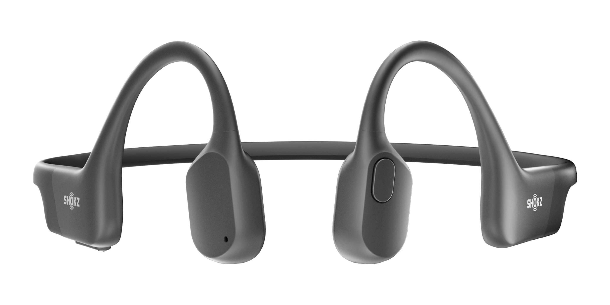

<Abstract>

This post is the first of a kind. I don't remember ever publishing a product endorsement before. But the **Shokz OpenRun** headphones solved a few problems for me. And at the same time surprised me beyond any expectations. If you are struggling with tinnitus, itching, or skin shedding, I recommend you try these _game changing_ headphones.

</Abstract>

<Hero>

</Hero>

Since my first _Walkman_ back in the 80s, through many mp3 players, and mobile phones, I have spent endless hours with :headphones: headphones on That's 4 decades of wearing headphones _all the time_ on public transport, the streets, at home.

For the last 10 years I have used only either [Sennheiser Momentum](https://www.google.com/search?q=Sennheiser+Momentum) or some sort of [AKG closed back studio headphones](https://www.google.com/search?q=akg+k271). Over-ears, always wired, no bluetooth, no charging, no noise-cancelling.

Unfortunately, due to a cluster of symptoms that I haven't managed to address, it is becoming harder to spend long periods of time listening to music on my headphones

And worst, this also applies to [making my own music](/about/music). :worried: There is no playing, recording, or mixing with headphones for a couple of hours without it resulting in terrible discomfort.

## First came the itch

At first it was just a bit annoying. A subtle itch now and then. Scratch, scratch, never mind, :hear_no_evil: continue listening to music.

But then it became more regular. And more intense. It went from annoying to irritating. I had to start putting down the music after a while because I would be permanently scratching my ears. :warning: _Don't scratch your ears!_

Eventually my ears started to get blocked now and then. Back in London it was happening once every two years. Then I moved to Barcelona and it started happening more often. Once a year, then twice a year, I found myself unable to hear properly for entire weeks as I tried to book "urgent" unblocking procedures. This was no longer just a nuisance. :angry: It was having a significant impact at work.

> Your ears just produce a lot of wax and you have an extremely narrow canal.

I visited several doctors and came back with miracle drops to prevent the wax buildup. :droplet: :ear: But it's hard to build an habit around something that stings. And even if I believed it was helping with the wax, it was doing nothing for the skin irritation and the itching.

In the end, I just accepted my condition and embraced the routine. I have preemptively scheduled the next visit every 3 or 4 months and pray :pray: my ears don't get blocked when on vacation, trying to take surf lessons, like last year. :cry: Two weeks of vacation in paradise and I could only get my head under water during the first 2 days.

## I can't live without music

Working from home, sometimes sharing the space with other family members, means that I am already forced to wear headphones for at least 3 hours of daily calls. So, the toughest consequence of my :ear: saga is that I almost don't have any time to listen to music.

Worst, since I finished my little [Ambivalent Red](/about/music) project, almost one year ago, I don't even feel like recording more music. The process of spending hours scrutinising takes, editing, tuning effects, mixing... my favourite hobby suddenly became unthinkable.

I can't also listen to music when I am doing sports. In-ear headphones don't work for me - they just don't fit the _extremely narrow canal_ - and over-ear ones are too heavy for skateboarding or practicing tennis. Finally it's against the law and common sense :sweat_smile: to wear headphones while cycling.

## Bone conduction to the rescue

A few friends that ride motorbikes had previously hinted at bone conduction headphones before. These exotic type of headphones don't go in or over the ears at all! Perfectly legal apparently, and very useful for taking phone calls, or following GPS instructions. But would they rock? :the_horns:

These "bone conductive" headphones are relatively new. They use small transducers to convert sound into vibrations and hammer them directly into the skull. :loud_sound: :skull: These vibrations are then transmitted through the bones in your head to your inner ear, where they are converted back into sound.

Since I am really good at ignoring really good advice, it was only by the end of 2022, and as a gift, that these [Shokz OpenRun](https://shokz.com/products/openrun) entered my life.

I tried them out with some considerable skepticism. :unamused: Not only I was expecting to feel some discomfort from the exotic frame shape, I was expecting a subpar sound experience: weak bass, muddy mid-range, limited high range.

But the moment I heard the crystal clear powerful sound :exploding_head: I was blown away! And my mind was immediately racing through all the things I can finally do!!

I can finally start going out skateboarding :skateboard:, cycling :bike:, or hitting :tennis: against the wall. All while listening to music! And yes, the OpenRun headphones can rock! They can even do metal, :the_horns:, or funk, classical, pop, and all that jazz.

Will you believe me when I say these are the most comfortable headphones I have ever wore? They're so light that I just forget I have them on. They also sit there in the same position all the time, and don't even budge, no matter how aggressive the activity.

## Shokz for the win

You might be thinking the sound quality is not as good, not as powerful, not as gourmet or whatever you like to call it.

Well, for sure the profile is a little different. There might be less low-end. But on the other hand, the low and mid lows have a lot more definition and separation. I actually find it's easier to pick up bass lines and kick drums when the sound is clearer, as opposed to just louder or deeper into the sub-bass frequencies.

What more can I say? The operation is super simple. The battery lasts 8 hours of continuous play. The build seems to be simple and robust. I hope they last forever.

But above all, they stay away from my ears! I can still hear the ambient sound and, more importantly, my ears are breathing naturally. No more itching and scratching, and after 2 months of intense use, I have the feeling the wax buildup has slowed down. Jury is still out on this one, but I have an appointment scheduled for next month. :crossed_fingers: Let's see!
