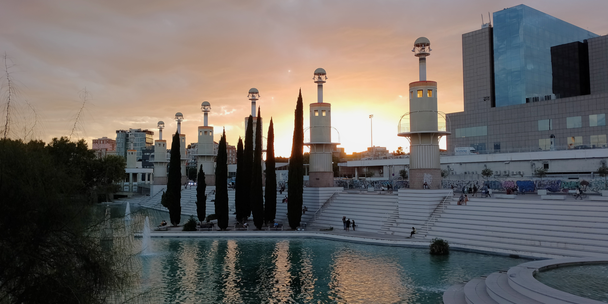
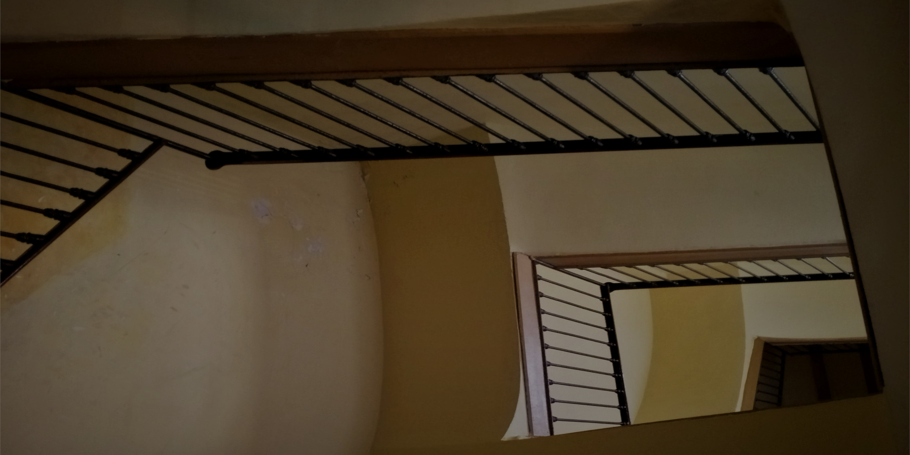
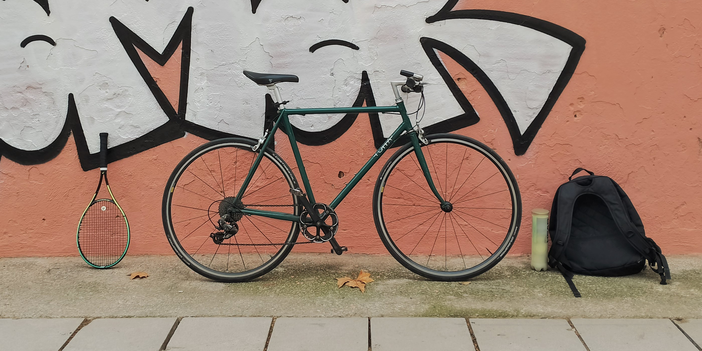
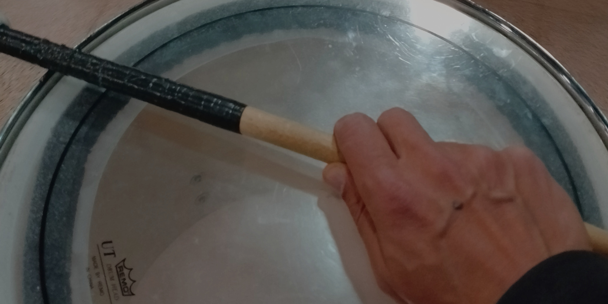

<Hero>

</Hero>

<Abstract>

As an aftershock of the lockdown and deconfinement agony, I started having anxiety attacks every now and then.

This is the story of my descent into a paralysing fear of being anxious. :scream: And how I picked up a racket and a pair of drum sticks to replace cigarettes and procrastination with sweating, friends, and commitments. :muscle:

</Abstract>

I got through the lockdown _just fine_. :see_no_evil:

For the rest of 2020 and most of 2021, I also got through the confinements _just fine_. :see_no_evil: :speak_no_evil: If we forget a frozen shoulder injury that took 18 months to heal, of course.

But by the end of 2021, with _everything_ almost back to _normal_, I suddenly experienced a few anxiety attacks. First at a cosy dinner with friends, a street market, a walk around the neighbourhood.

And later, during the 2022`s winter, things got way, way worse. I mean real, real bad. :worried: Like having frequent panic attacks at seemingly arbitrary places or situations. A supermarket isle, a regular work meeting, the last step down a staircase, ...

Always without signs of real danger, and without any common context or apparent cause. And without warning. :face_exhaling:

## Agoraphobia? Claustrophobia? Stress? :thinking_face:

At some point I was convinced I had developed some sort of [agoraphobia](https://www.health.harvard.edu/blog/agoraphobia-has-covid-fueled-this-anxiety-disorder-202103152409). There were cases when just leaving the house for groceries was enough to trigger the scare.

From the desk where I am writing this post I can see the spot in the patio downstairs where I suddenly felt dizzy :dizzy:, nauseated, trembling, hyperventilating. Palms sweating, heart racing, compressed chest, dry mouth, everything all at once.

> Oh no! Fuck! Not this shit again.

I recall trying to look up to the sky, in the distance, or just down to my feet. Taking deep breaths, trying to get a hold of me, trying to walk one step forward at a time, trying to think.

I eventually ruled out agoraphobia because it was also happening when working comfortably at my desk, in the quiet cosiness of home.

At this point I was pretty much expecting a panic attack any given day. Some were mild and I could get back in control with a glass of water and a few minutes chilling. But on 3 occasions, if I recall correctly, I ended up trembling in a hospital waiting room, _patiently_ asking for help.

> Yes I know it's probably all in my mind, but can you please check my chest? it hurts and my brain is telling me that I am about to die at any moment.

That bad.

## Some things had to change

My last _big_ panic attack happened in May 2022. It started after a normal lunch on a normal Tuesday and it lasted more than 3 excruciating long hours.

> Just a dude in his mid-life crisis, with some weird long blue hair, having a panic attack. He will be fine.

I always empathised with the doctors and nurses at the hospital. They had to be proportionally concerned with me, versus the pandemic priorities around them. That is to say: they were zero preoccupied.

But I am sure 200 minutes of hyperventilation, palpitation and uncontrollable shaking can't be any good for anyone's physical health. Not to speak of the mental health. I had been spiraling down this pattern of _oh fuck, is it happening again?_ and I had to break this self-reinforcing and maddening cycle.

At this point I had already tried a few prescriptions. Mostly placebo and natural stuff, either prescribed at the hospital or suggestions from family and friends. But these weren't working at all. And anxiolytic medication is not an option I ever want to contemplate.

The next step was to get professional mental health assistance.

However, as I looked through numbers I could call - different therapeutical approaches and people I could ask for advice - I asked myself a clear cut question:

> Did I try everything within my reach to make this stop?

Obviously not.

My fitness was also at an all time low, and work related stress probably at an all time high. :tired_face: I was still smoking a few cigarettes :smoking: a day, drinking too many cups :coffee: of coffee, and having irregular sleep schedules.

These factors are undoubtedly all connected, and the chance to disrupt the patterns and break the cycle, was right there in front of me.

I just needed to commit to a few radical changes.

## Get with the program

Quitting tobacco and reducing coffee, were the first evident answers. But it was also clear that I had to make other adjustments. Otherwise, this experiment wouldn't last long. Eventually, I could even be making it all worst.

Within a day of my last visit to the hospital, I settled with the following resolutions:

- Quit smoking. Effective immediately, forever.
- Only drink coffee in the morning.
- Take a break from work. The upcoming holidays are a serious thing.
- Get fit. Start doing sports daily.
- Get busy.

I quit smoking in June and didn't have a single _serious_ anxiety attack since then. I have felt some mild symptoms, but was always able to control it just with breathing.

The rest of the program was essential to get through it, though. Especially the _get busy_ part. I had already [quit smoking a hundred times](https://quoteinvestigator.com/2012/09/19/easy-quit-smoking/) so I knew how important it is to have something to do instead of _that_ cigarette. In practical terms, _every single time_ I would crave a cigarette, I had to quickly replace it with something else: something good.

I really look forward to writing about the _get fit_ part and how I started playing (obsessing) about tennis. I will probably also write about the _cold turkey_ approach to overcoming a 30 year old addiction.

<Todo>Post: tennis</Todo>

<Todo>Post: cold turkey</Todo>

But for now, I'll wrap this up with the strongest strategy I could find to _get busy_: back to playing music!

## Get busy following my dreams

Going back to [making music on my own](/about/music) wasn't going to work in this context. Spending hours alone, at this same desk where I work, recording and mixing, consumed with tiny details until stupid o'clock is a terrible idea for someone wanting to quit smoking.

Instead, I needed a serious and purpose driven commitment to making music with other people. And I mean more than a Thursday evening jam with friends that gets cancelled now and then, leaving me anxious, craving, ...

<Todo>Post: jamming</Todo>

I meant a commitment to join other committed people in creating music together, rehearsing regularly, and playing live, semi-professionally.

First I tried to find a band as a guitar player. But couldn't find one. Eventually, I did meet a singer-songwriter that was looking for a support musician. I even auditioned for them and it looked like it could work. But they thought my playing style didn't actually fit. It was cool :sunglasses: they said, but I do not have _that jazz_ they were looking for. :smirk: They were right about that. I've got no _jazz_ in me.

So I had to dig deeper into my courage, and go out of my comfort zone. Way out of my comfort zone. :stuck_out_tongue_winking_eye:

## Tabalers is not batucada

This next step was actually making me anxious, and it took me a couple of months to muster up the courage. I had seen these local groups of people playing drums in the street many times, some of them in the context of these crazy [correfoc](https://en.wikipedia.org/wiki/Correfoc) events.

Was playing drums close to the fire something too intense for someone afraid of having a panic attack? Or was this exactly what I needed?

I reached out to my neighbourhood's group, the [Tabalers de Sants](https://twitter.com/TabalersS) group, the percussion group that supports the [Colla de Diables de Sants](https://www.barcelona.cat/culturapopular/en/festivals/fire/diables/colla-de-diables-de-sants).

> :wave: I am a Portuguese dude that lives here since 2017 but it took me 5 years to find the courage to get in touch. Every year I watch groups like yours playing at correfocs and I feel this mortal envy of the fun you're having there. I have plenty of rhythm and have been playing drums, guitar, bass for a long time. Can I join?

I am not a local. And despite the 5 years in Barcelona, I didn't make that many Catalan connections.

Somehow, their quick reply, was a bit of a surprise:

> Of course you can join if you have desire to be a part of a drumming group for a _colla de diables_.

This _devil groups_ thing is a Catalan tradition that involves fire, explosions, beasts, drums, ... :fire: :dragon: :boom: :drum_with_drumsticks: In short, the most metal thing I have ever seen.

I wanted to join because of the music, the drumming together with others. But the reply is unambiguous: I need to be all in, and comfortable with everything else.

So, what if the only way out of the paralysing fear was actually through, literally, through the fire? :fire:

Continue reading, to know what happened when I got [up close to the fire, the dragons, and everything else](/posts/2023-03/there-is-nothing-more-metal-than-a-catalan-correfoc).
