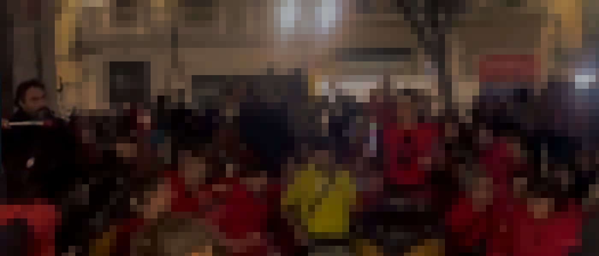

<Abstract>

No! :pinched_fingers: Not even close! There is nothing more metal than a Catalan [correfoc](https://en.wikipedia.org/wiki/Correfoc).

It's 10 minutes past 9 and I am still shaking in awe and excitement for all the crazy things I saw today. :drum_with_drumsticks: :fire: :boom: :dragon: :japanese_goblin: But it isn't over yet, is it?

</Abstract>

I am right in the middle of [Plaça de la Vila de Gràcia](https://goo.gl/maps/RnFgDXWBQjs5kwHf8) and the square is packed with people, costumes, gadgets, drums.

They've just ran the last of the obnoxiously loud and hazardous stuff down and the smoke is still settling.

But the drumming is still going loud. :drum_with_drumsticks: Four different groups converged here before the grand finale and over a hundred people of all ages are having a grand [tabalers](https://en.wikipedia.org/wiki/Drum) jam session.

> Baixeu! :point_down: Baixeu! :point_down:

Someone screams from the middle of the jam.

And the jam goes quieter :shushing_face: as they play clicking sticks on the sides of the drums. And they literally get down. They duck, squat, playing softer and closer to the ground.

> clickity-clack :chopsticks: clickity-clack :chopsticks:

Then the _[surdos](https://www.youtube.com/watch?v=S9tHmSbM2P4)_ start banging a stronger rhythm.

And the tension is building up again.

> dum :drum_with_drumsticks: dum :drum_with_drumsticks: dum :drum_with_drumsticks: .............
>
> dum :drum_with_drumsticks: dum :drum_with_drumsticks: dum :drum_with_drumsticks: .............

That's when I notice, on the left, one other _surdo_ player still ducking, and playing softly. :thinking_face: Why is he still hiding behind the drum? :thinking_face: And why isn't he actually powering through?

I see the person next to the shy drummer, clearly instigating them, pretty much pushing them:

> Get up! Come on! Play with them!

So the dude, stands up and joins the dum :drum_with_drumsticks: dum :drum_with_drumsticks: dum :drum_with_drumsticks: ...

Wait... Is that me?

Yes, indeed. _Aquell noi soc jo_ :upside_down_face:

If I have ever lived through a moment that would fit perfectly into the [HowWeGotHere](https://tvtropes.org/pmwiki/pmwiki.php/Quotes/HowWeGotHere) trope, then this was it.

The whole drum group comes back together, standing up, jumping around, screaming.

And in my little bubble, time is slowing down ... and I am thinking.

> I guess I made some cool decisions along the way.

So what exactly brought me here, to this exact moment, this drum, this stick?

As the trope goes:

> For that, we have to rewind back a year.

## Long story short

In a nutshell, on year ago I was just ...

[the toughest winter of my life](/posts/2023-03/the-toughest-winter).

// Todo

Tonight I was here just to take photographs but ran out of battery before the main event.

One of our _surdo_ players had hurt his hand and had basically called it a day
